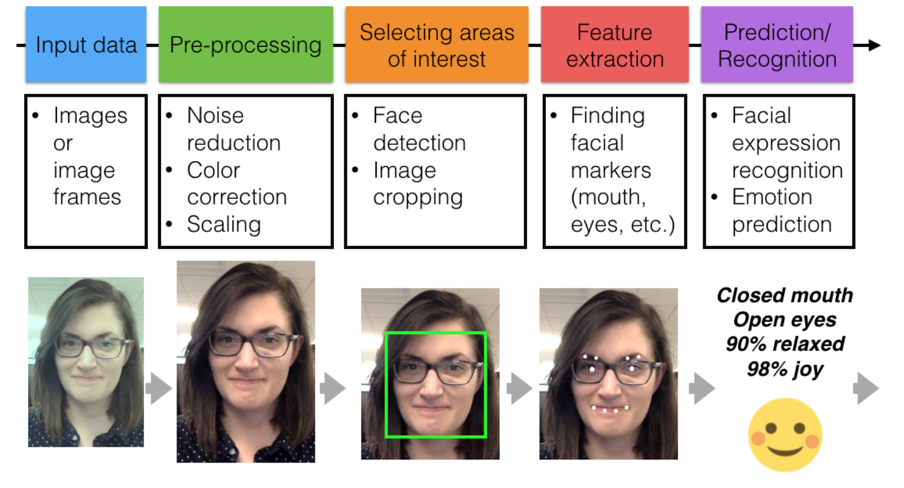

## Lesson 4: Image Recognition and Classification

Computer Vision Pipeline
A computer vision pipeline is a series of steps that most computer vision 
applications will go through. Many vision applications start off by acquiring 
images and data, then processing that data, performing some analysis and 
recognition steps, then finally performing an action. The general pipeline 
is pictured below!




> Image dimensions: (height, width, depth)

> %matplotlib qt  # for interactive plots


### Standardizing data

If the images are different sizes, or even cropped differently, then this 
counting tactic will likely fail! So, it's important to pre-process these 
images so that they are standardized before they move along the pipeline. 


### Image masks

```python

## TODO: Define the color selection boundaries in RGB values
# play around with these values until you isolate the blue background

lower_blue = np.array([0,0,220]) 
upper_blue = np.array([50,70,255])

# Define the masked area
mask = cv2.inRange(image_copy, lower_blue, upper_blue)

# Vizualize the mask
plt.imshow(mask, cmap='gray')


# Mask the image to let the pizza show through
masked_image = np.copy(image_copy)

masked_image[mask != 0] = [0, 0, 0]

plt.imshow(masked_image)

# Load in a background image, and convert it to RGB 
background_image = cv2.imread('images/space_background.jpg')
background_image = cv2.cvtColor(background_image, cv2.COLOR_BGR2RGB)

# Crop it to the right size (514x816)
crop_background = background_image[0:514, 0:816]

# Mask the cropped background so that the pizza area is blocked
crop_background[mask == 0] = [0, 0, 0]

# Display the background
plt.imshow(crop_background)

# Add the two images together to create a complete image!
complete_image = masked_image + crop_background

# Display the result
plt.imshow(complete_image)
```


### Color spaces

- RGB: 
- HSV: Hue Saturation Value
- HLS: Hue Lightness Saturation

#### HSV:

For different lighting conditions, difficult to mask using RGB. So, we use HSV
space.

- Isolates the Value(V) component, which varies the most under different
  lighting conditions. - V: measure of brightness
- The H channel stays consistent in shadow or excessive brightness
- We should be able to detect objects more reliably than in RGB color space

```python
# Convert from RGB to HSV
hsv = cv2.cvtColor(image, cv2.COLOR_RGB2HSV)

# HSV channels
h = hsv[:,:,0]
s = hsv[:,:,1]
v = hsv[:,:,2]

f, (ax1, ax2, ax3) = plt.subplots(1, 3, figsize=(20,10))

ax1.set_title('Hue')
ax1.imshow(h, cmap='gray')

ax2.set_title('Saturation')
ax2.imshow(s, cmap='gray')

ax3.set_title('Value')
ax3.imshow(v, cmap='gray')

```

Pink balloons along with shadows and varying light conditions are selected using
HSV but RGB misses the shadows. 

Use [color picker](https://www.w3schools.com/colors/colors_picker.asp) to select
value ranges for masks.


Stndardize input:

```python
width = 1100
height = 600
standard_im = cv2.resize(image, (width, height))
```

### Day and Night Classifier

- Standardize image
- ENcode labels
- Calculate average brightness using V value of HSV channel
- Classify using a threshold for average brightness

  Implementation in notebooks files

