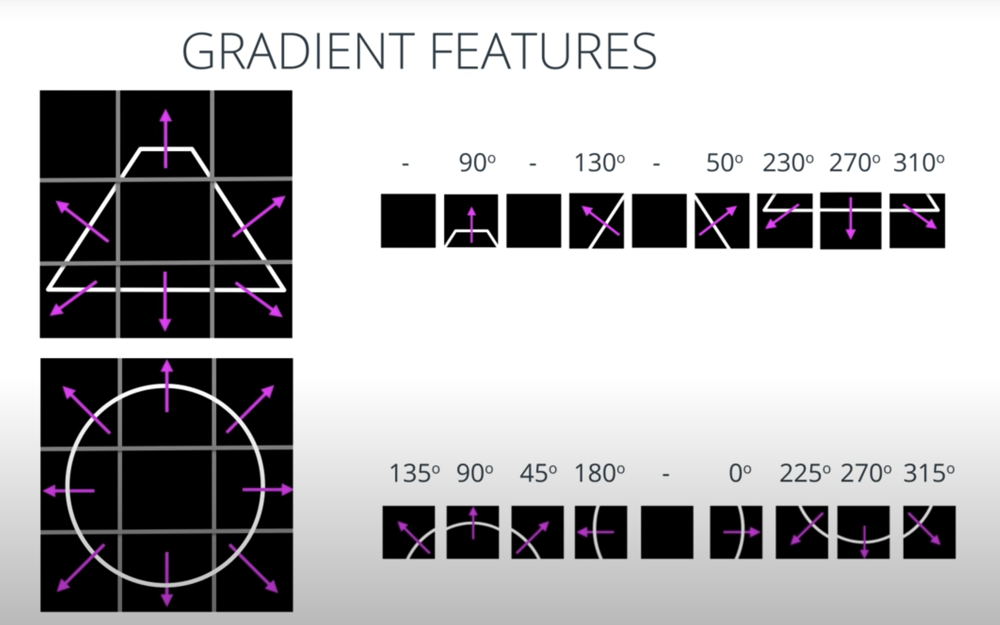
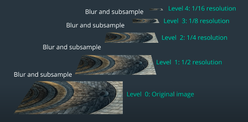
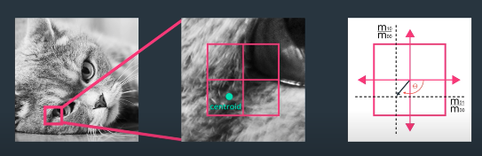
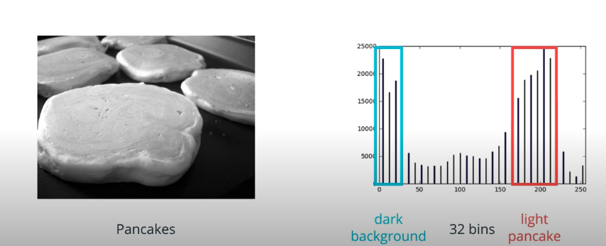
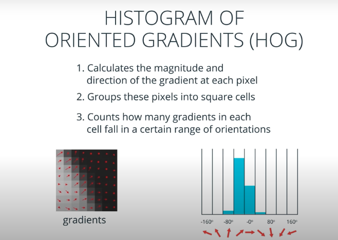

# Feature Vectors

How can we actually uses the features to detect whole objects?

For object detection, we have to look at distinct sets of features called
`feature vectors`.

If we break an image up into a grid of cells and look at the direction of
gradient in each cell with respect to the center of trapezoid, we can flatten
this data to create a 1d array which is the feature vector. In this case, it is
the vector of gradient directions.

- We get different feature vector for each shape.
- These feature vectors can be used to distinguish shapes also considering they allow enough
    flexibility to detect some variation in these shapes while remaining
    distinct enough to be able to distinguish different shapes.

## Oriented Fast and Rotated Brief (ORB), Feature Descriptors

- fast object recognition algorithm 
- essential for AR, Robitics, Self driving cars (they need to respond to input
    video streams in real time, so time is critical)
- eg self driving cars require to consistently check for other cars
- ORB used to quickly create feature vectors of key points in an image. The
    feature vectors can then be used to identify objects in images.

- Fast and brief are a feature detection in a vector creation algorithm
    respectively. 
- impervious to noise, illumination and image transformations (rotation)

1. begins by finding keypoints (distinctive features eg corners) in an image
2. calculates corresponding feature vector (descriptor) for each key point. The
   feature vector are binary feature vectors (contain only 1s and 0s)
   
   Eg. $V_1 = [01011100..10]$
    
   The sequence of 1s and 0s vary according to what specific keypoints and
   surrounding pixel area look like.

   The vector represents the patterns of intensity around a keypoint.

   Hence, multiple feature vectors can be used to identify a larger area or a
   specific object in an image.

### 1. FAST (Features from Accelerated Segments Test)

- used for 1st step i.e. keypoint detection
- selects keypoints by conmparing the brightness levels in a given pixel area.
- Given a pixel P in an image, FAST compares the brightness of P to a set of 16
    surrounding pixels that are in a small circle around P. Each pixel in this
    circle is then sorted into 3 classes: brighter than p, darker than p,
    similar to p.
- $I_P = $ Intensity of pixel $P$ i.e. the brightness of pixel $P$.
- For a given threshold $h$,
  - Brighter pixels: Brightness $> I_P + h$
  - Darker pixels: Brightness $< I_P + h$
  - Similar pixels: $I_P - h <$ Brightness $< I_P + h$

- Pixel $P$ is selected as a keypoint if more than half (8) connected pixels on the
    circle are either darker or brighter than P.

### Optimization:

Same result can be achieved by comparing P to only 4 equidistant pixels in the
circle instead of 16. 

Keypoints detected by FAST gives us information about the location of object
defining edges in an image but don't include info about direction of change of
intensity. So, we cannot distinguish between horizontal and vertical edges.

### 2. BRIEF (Binary Robust Independent Elementary Features)

- used for 2nd part i.e. to turn the keypoints to feature vectors that together
    can represent an object. 
- creates binary feature vectors from a set of keypoints.
- 128 - 512 bit string (eg 1 bit string: 0, 2 bit string: 01)
- advantage of using binary feature vectors is that they ccan be stored
    efficiently in memory and can be computed quickly.
- So, fast and crucial for real time applications and able to run on devices
    with very limited computational resource like smartphones.

1. Smooth given image by Gaussian Kernel to prevent being sensitive to high
   freequency noise.

2. For each keypoints:
   
   - For each bit in feature vetor: (eg 256 bits)
     
     - selects a random pair of pixels inside a defined
      neighborhood around that keypoint called patch/window (square with some pixel width
      and height)

        - The first pixel in the random pair: drawn from Gaussian distribution
       centred around the keypoint and a spread (S.D.) of $\sigma$
        - The second pixel in the random pair: drawn from Gaussian distribution
       centred around the first pixel and a spread (S.D.) of $\frac{\sigma}{2}$
        - This choice improves the feature matching rate. 

     - Construction of feature vector:
        
        - If the first pixel is brighter than the second, assign the value of 1 to
       the corresponding bit in the descriptor, otherwise assign 0.
       Eg. for 1st random pair, we assign the 1st bit value as 0 or 1 i.e. 
       $V = [0 ... ]$ or $V = [1 ...  ]$

## Scale and Rotation Invariance:

- ORB builds an image pyramid - multi scale representation of a single image
    that conists of a sequence of images all of which are the versions of
    original image at different resolutions. Each level in the pyramid conists
    of a downsampled version (lower resolution) of the image in the previous version.

  

- It uses the FAST algorithm to quickly locate keypoints in the differently
    sized images in each level. So, ORB is effectively locating keypoints for the objects at different
    scale to achieve partial scale invariance.

- Assigns orientation to each keypoint like left or right facing depending on
    how level of intensity changes around that keypoint.

    For each image in image pyramid: 
    - calculate the intensity centroid (position of average pixel instensity in
        a patch) inside a box centered at the keypoint. 
    - Orientation of keypoint obtained by drawing a vector from the keypoint to
        the intensity centroid

    

- Note that patch size is not reduced in size at each level. So, the image area
    covered by the same patch at each level will be larger resulting into
    keypoints having different sizes. Keypoints with bigger size will be found
    in higher levels of the pyramid.

- Now, ORB uses rBRIEF (Rotation-Aware BRIEF) i.e. modified version of BRIEF
    which can create the same vector for keypoints no matter the orientation of
    an object. Thus makes the ORB algorithm rotaion invariant i.e. can detect
    same keypoints in an image rotated at any angle.

- rBRIEF:
  - starts in the same way as BRIEF i.e. by selecting 256 random pairs of pixels
      inside a defined patch around a given keypoint to construct a 256 bit
      vector.
  - It then roates these random pairs of pixels by the orientation angle of the
      keypoint, to align the random points with the orientation of the
      keypoint.

  - compares the brightness of the random pairs of the pixels and assigns 1s and
      0s accordingly creating the corresponding feature vectors. The set of all
      the feature vectors for all the keypoints found in an image is called ORB
      Descriptor.

## Image Matching

Suppose we want to detect a face in another image of different people.

- Training image - Face
- Query Image - Image of people in which face detection is to be performed

1. Calculate ORB descriptor for training image and save in memory.
2. Calculate ORB descriptor for query image and save in memory.
3. Keypoint matching between the two images using the corresponding descriptors.
   Done by a matching function which comapares two keypoints by calculating the
   similairty between their corresponding feature vectors. 

   Hamming metric is usually used for ORB since it is extremely fast. It counts
   the number of dissimilar bits between the binary descriptors. 

## Application: ORB in Video

Tracking and Identifying Objects in real time video streams:

Compute ORB descriptor for the image to be tracked and save in memory. Then for
each frame in an incoming video stream, calculate ORB descriptor, and use a
matching function to compare the keypoints in the current video frame with the
saved descriptors. 

If we find that the matching function returns a number of mathes above some
match threshold, we can conlcude the object is in frame.

Threshold = % of keypoints.

- ORB extremely fast so possible in real time
- works best when lot of consistent features that are not affected by background
    of an image. Eg facial detection
- does not work well for general object recogntion like pedestrain detection. 

Properties:

1. Scale Invariance
2. Rotation Invariance
3. Illumination Invariance
4. Noise Invariance

## Histogram of Oriented Gradients (HOG)

Oriented gradients - direction of image gradients

