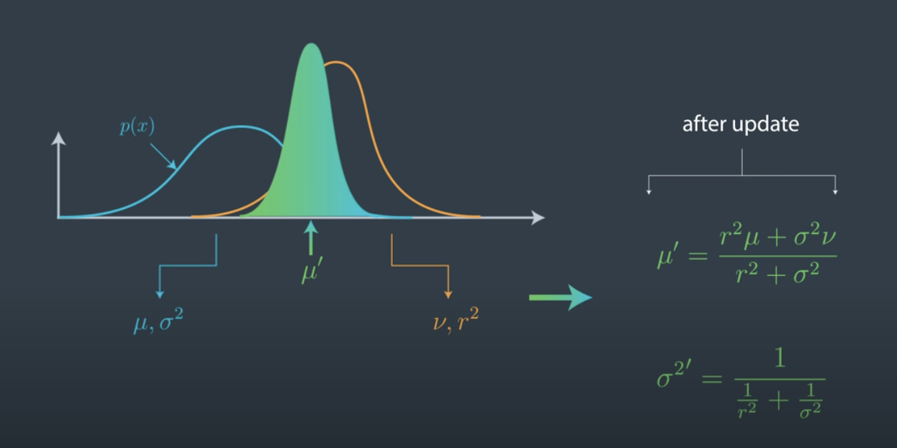
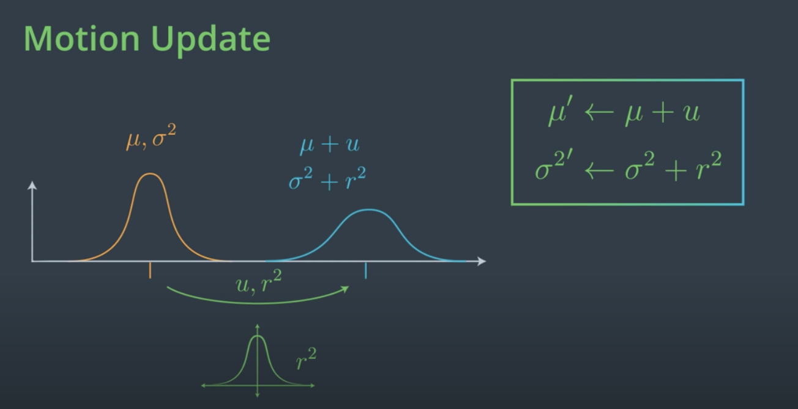
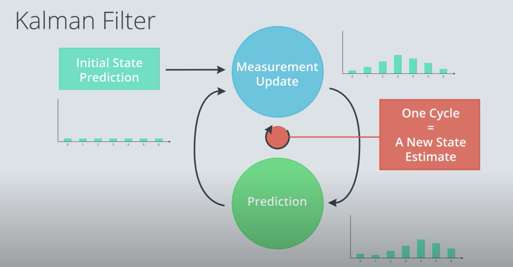

# Kalman Filters

- very popular technique for estimating the state of a system. Similar to the
    probabilistic localization method (Monte Carlo localization in lesson 2)

- difference in these tracking algorithms: 

|Kalman Filters|Monte Carlo Localization|
|---|---|
|estimating Continuous state| Discrete states|
|uni modal distributions| Multi-modal distributions|
|Approximate Gaussian Distribution| Estimate Histogram|

- A Kalman filter gives us a mathematical way to infer velocity from only a set of measured locations.
- Gaussian with smallest variance preferred (since ot has minimum uncertainty)

- For uncertain, continuous quantities, such as the estimated location of a self-driving car, we use Gaussians to represent uncertainty in that quantity. The smaller the variance, the more certain we are about a quantity.

- 2 cycles:
  - Measurement Update - Bayes Rule (Product)
  - Prediction - Total Probability (Convolution)

- WHen we combine 2 Gaussians, (prior and event probability distribution) then the resulting posterior Gaussian has
    higher peak i.e. smaller variance which means more certainty since
    information content is higher.

## 1. Measurement Update Cycle
  

## 2. Motion Update Cycle (predict step)
  

2d-Kalman filters can also estimate velocity by obersving the locations which is
very helpful in predicting the next location of the object.

The beauty of Kalman filters is that they combine somewhat inaccurate sensor measurements with somewhat inaccurate predictions of motion to get a filtered location estimate that is better than any estimates that come from only sensor readings or only knowledge about movement.

