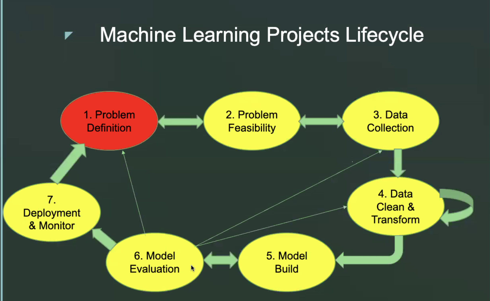

# Machine Learning Projects Lifecycle

## 1. Problem Definition

## 2. Problem Feasibility

- Do we have technical resources to do the project?
- Is the target well defined?
- Do we have enough data?

## 3. Data Collection

- Imabalanced class problems (eg fraud detection - classify all doctor as non
  fraudulent, we will get 99% accuracy)
- Data biasness (Example: Census: some area dangerous, so only 50% of the
    samples in dangerous areas collected. So, we need to debias the data for
    true results. Voting Donald trump example)

## 4. Data Clean & Transform

## 5. Model Build

- Identify task first (eg Sequence classification task using Sequence to 
  sequence models, Stock price prediction eg Regression)
- May do in one framework and 
- Does the framework have the required algorithm?
- Explainabaility of model (eg in medical problems, if you detect fraud, why 
  is he fraud? which part led to prove cancer?)
- Avoid Overfitting (Cross validation)
- Speed

## 6. Model Evaluation

- Base level accuracy (eg predicting the majority class)
- False positives and False negatives (In medical, false negatives are dangerous and costly)

## 7. Deployment and Monitor

- Model dependencies (eg model depended on wikipedia. Later wikipedia updated
    the version. So, mayneed to rebuild the model.)
- So deployment and monitoring required
