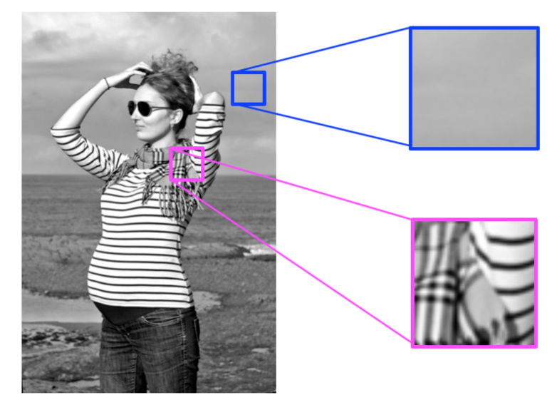

# Lesson 5: Convolutional Filter and Edge Detection

## Filters

Intensity is a measure of light and dark similar to brightness, and we can use this knowledge to detect other areas or objects of interest. For example, you can often identify the edges of an object by looking at an abrupt change in intensity, which happens when an image changes from a very dark to light area, or vice versa.

To detect these changes, you’ll be using and creating specific image filters that look at groups of pixels and detect big changes in intensity in an image. These filters produce an output that shows these edges.

## Frequency in images

- Analogy to frquency in sound
- frequency in images is a rate of change.

### High and low freq

- High frequency image is one where the intensity changes a lot. And the level of 
  brightness changes quickly from one pixel to the next. 

- A low frequency image may be one that is relatively uniform in brightness or 
  changes very slowly.



- High-frequency components also correspond to the edges of objects in images, 
which can help us classify those objects.

## Fourier Transform

- decompose an image into its frequency components
- output of an FT represents the image in the frequency domain, while the input
  image is the spatial domain (x, y) equivalent
- In the frequency domain image, each point represents a particular frequency 
  contained in the spatial domain image. So, for images with a lot of 
  high-frequency components (edges, corners, and stripes), there will be a 
  number of points in the frequency domain at high frequency values.
  
### Fourier Transfrom in OpenCV

```python

import numpy as np
import cv2
from matplotlib import pyplot as plt

img = cv2.imread('messi5.jpg',0)

dft = cv2.dft(np.float32(img),flags = cv2.DFT_COMPLEX_OUTPUT)
dft_shift = np.fft.fftshift(dft)

magnitude_spectrum = 20*np.log(cv2.magnitude(dft_shift[:,:,0],dft_shift[:,:,1]))

plt.subplot(121),plt.imshow(img, cmap = 'gray')
plt.title('Input Image'), plt.xticks([]), plt.yticks([])
plt.subplot(122),plt.imshow(magnitude_spectrum, cmap = 'gray')
plt.title('Magnitude Spectrum'), plt.xticks([]), plt.yticks([])
plt.show()

```

## High Pass Filters

- It can be used for edge detection
- sharp changes in image intencity only capttured i.e edges are captured. 
- Done using kernel convolution which relies on centering a pixel 
  and looking at it's surrounding neighbors.
- The sum of elements in kernel filter must be 0 otherwise, there may be effect
  of increase or decrease in brightness of the image.

### Edge Handling

- **Extend**: The nearest border pixels are conceptually extended as far as necessary
  to provide values for the convolution. Corner pixels are extended in 90° wedges. 
  Other edge pixels are extended in lines.

- **Padding**: The image is padded with a border of 0's, black pixels.

- **Crop**: Any pixel in the output image which would require values from
  beyond the edge is skipped. This method can result in the output image 
  being slightly smaller, with the edges having been cropped.

## Creating filter to detect edge

```python

sobel_y = np.array([[ -1, -2, -1], 
                   [ 0, 0, 0], 
                   [ 1, 2, 1]])

## TODO: Create and apply a Sobel x operator


# Filter the image using filter2D, which has inputs: (grayscale image, bit-depth, kernel)  
filtered_image = cv2.filter2D(gray, -1, sobel_y)

plt.imshow(filtered_image, cmap='gray')

```

### Create binary image by thresholding:

```python
retval, binary_image = cv2.threshold(filtered_image, 100, 255, cv2.THRESH_BINARY)

plt.imshow(binary_image, cmap='gray')

```

- Low pass filter often used to reduce unwanted noise before applying high pass
filter

## Gradients and Filters

If we think back to treating images as functions, $F(x, y)$, we can think of 
the gradient as a derivative operation $F’(x, y)$. 
Where the derivative is a measurement of intensity change.

## Sobel Filters

Applying a Sobel filter to an image is a way of taking (an approximation) 
of the derivative of the image in the $x$ or $y$ direction. The operators 
for $Sobel_x$ and $Sobel_y$, respectively, look like this:

$S_x = \begin{bmatrix}
-1 & 0 & 1\\
-2 & 0 & 2\\
-1 & 0 & 1
\end{bmatrix}$

$S_y = \begin{bmatrix}
-1 & -2 & -1\\
0 & 0 & 0\\
1 & 2 & 1
\end{bmatrix}$

Taking the gradient in the xx direction emphasizes edges closer to vertical. 
Alternatively, taking the gradient in the yy direction emphasizes edges closer to horizontal.

### Magnitude

Sobel also detects which edges are strongest. 
This is encapsulated by the magnitude of the gradient; the greater the magnitude,
the stronger the edge is. The magnitude, or absolute value, of the gradient is 
just the square root of the squares of the individual x and y gradients.

$\textrm{abs_sobelx}= \sqrt{(sobel_x)^2}$ 

$\textrm{abs_sobely}= \sqrt{(sobel_y)^2}$

$\textrm{abs_sobelxy}= \sqrt{(sobel_x)^2+(sobel_y)^2}$

### Direction

The direction of the gradient is simply the inverse tangent (arctangent) of the 
$y$ gradient divided by the $x$ gradient:

$tan^{-1} (sobel_y / sobel_x)$


## Low pass filter

- to reduce high frequency noise
- equivalent to taking average of center pixels and neighboring pixels
    altogether.
- We will get smoother image as a result.
- Eg:
  $\frac{1}{9} \times 
  \begin{bmatrix}
  1 & 1 & 1\\
  1 & 1 & 1\\
  1 & 1 & 1
  \end{bmatrix}$

- Gaussian blur most used low pass filter in CV. It both blurs and better
preserves the edges in it.

  $\frac{1}{16} \times 
  \begin{bmatrix}
  1 & 2 & 1\\
  2 & 4 & 2\\
  1 & 2 & 1
  \end{bmatrix}$

## Edge detection

Grayscale > Low pass filter > High Pass Filter > Binary Threshold

### Canny edge detector - most popular

1. Filters out noise using Gaussian blur
2. Finds the strength and direction of edges using Sobel filters.
3. Applies non-maximum supression to isolate the strongest edges and thin them
   to one-pixel wide lines
4. uses hysteresis (a double thresholding process) to isolate the best edges.

#### Hysteresis:

- If Intensity $F(x,y) > $ High threshold, then strong edge
- If Intensity $F(x,y) < $ low threshold, then weak edge and discarded
- If low threshold < Intensity $F(x,y)$ < high threshold considered as edge only
  if connected to strong edge

In this way, canny eliminates weak edges and noise and isolates the edges that
are most connected and most likely to be part of an object boundary.

- very useful in boundary and shape detection


## Edges to Boundaries and Shapes

Hough transform, which transforms image data from the x-y coordinate system 
into Hough space, where you can easily identify simple boundaries like lines
and circles.

The Hough transform is used in a variety of shape-recognition applications

Line space - > Hough (Parameter) space:

$ y = m_0x + b_0 $ - > $(m_0, b_0)$

Each point $(x,y)$ gives a line in Hough space. Eg $(1,1)$ > $1 = m_0 + b_0 $

`Concept: If we have a line made of mini segments or points close to the same
line equation in image space, this turns into many intersecting lines in Hough
space `

Imagine this line as part of an edge detected image where a line just has small
discontinuities in it. 

Our strategy to find countinuous lines in an image is to look at intersecting
points in Hough space.

For cases with infinte slopes (straigh up and down lines), doesnt work. SO polar
coordinates better. 

$\rho = x\cos\theta + y\sin \theta$

Polar space < - > Hough space more suitable

If square > In Hough space, there must be four intersections.

Opencv function args:

- rho, theta > Hough variables which define resolution of detection
  1 pixel and 1 degree

- threshold = min no of Hough space intersections it takes to find the line

- min_line_length = 50
- max_line_gap = 5 (gap between discontinuous line segments)

## Haar Cascades

Eg face detection

- positive (face) and negative (non face) images
- detects so called Haar features (gradient measurements that look at
    rectangular regions around a certain pixel area and somewhat subtract these
    areas to calculate a pixel difference.)
- similar to how concvolution kernels work but at a larger scale
- detects edges, lines complex rectangular patterns
- face detection - lines and rectangles are useful features because patterns of
    alternating bright and dark areqas define a lot of features on a face. Eg.
    pupil - very dark feature, cheeks and chins - define a gradient outline for
    a face. 
- So, 1st step similar to convolution
- 2nd step is cascades. In image large portion is non face. 
- looks at an image and applies a Haar feature detector like vertical line
    detector and then performs classfication on entire image.
- If doesn't get enough of a feature detection response, classifies ara of image
    as non face, and discards it.
- feeds reduced image area to the next feature detectir and classifies the image
     again, discarding irrelevant non face areas at every step. This is called
     cascade of classifier.
- very fast algorithm due to removing of irrlelvant information.

## Type of features

- Color-based: eg useful for day/night classification, implementation of green
    screen
- Shape-based: stop sign vs other traffic sign classification requires both
    shape and colour, face detection

Edges are one of the simplest shapes that you can detect; edges often define the
boundaries between objects but they may not provide enough information to find 
and identify small features on those objects (such as eyes on a face)
