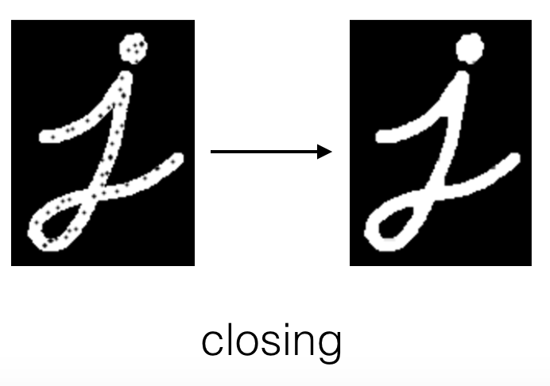

# Lesson 6: Types of Features and Image Segmentation

## Types of Features

1. Edges
2. Corners
3. Blobs


1. Edges - Areas in an image where the intensity abruptly changes i.e. Areas with a high intensity gradient
2. Corners - Intersection of two edges and looks like a sharp point.
3. Blobs - Region based features - areas of extreme brightness or unique
   texture.

Most interested to detect corners since corners are the most repeatable features
i.e. easy to recognize given two or images of same scene

Compare the 3 features using Mondrian painting. (Check fusemachines content)


## Corner Detection

- Using window, to find regions where gradient change is maximum.
- Opencv Implementation

    ```python
    dst = cv2.cornerHarris(gray, 2, 3, 0.04)
    dst = cv2.dilate(dst, None)
    ```
- Dilation enlarges bright regions or regions in the foreground like the corners
    so that we will be able to see them better.

- Select strongest corners using a threshold value

### Dilation and Erosion

- Dilation and erosion are known as morphological operations. They are often 
  performed on binary images, similar to contour detection. Dilation enlarges
  bright, white areas in an image by adding pixels to the perceived boundaries
  of objects in that image. Erosion does the opposite: it removes pixels along
  object boundaries and shrinks the size of objects.

- Often these two operations are performed in sequence to enhance important 
  object traits!

#### Dilation

To dilate an image in OpenCV, you can use the dilate function and three inputs: an original binary image, a kernel that determines the size of the dilation (None will result in a default size), and a number of iterations to perform the dilation (typically = 1). In the below example, we have a 5x5 kernel of ones, which move over an image, like a filter, and turn a pixel white if any of its surrounding pixels are white in a 5x5 window! We’ll use a simple image of the cursive letter “j” as an example.

```python
# Reads in a binary image
image = cv2.imread(‘j.png’, 0) 

# Create a 5x5 kernel of ones
kernel = np.ones((5,5),np.uint8)

# Dilate the image
dilation = cv2.dilate(image, kernel, iterations = 1)
```

#### Erosion

To erode an image, we do the same but with the erode function.

```python
# Erode the image
erosion = cv2.erode(image, kernel, iterations = 1)
```


### Opening:

- Erosion followed by Dilation
- useful in noise reduction
- erosion gets rid of noise then dialtion enlarges the object
-
```python
opening = cv2.morphologyEx(image, cv2.MORPH_OPEN, kernel)
```


### CLosing

- Dilation followed by erosion
- useful in closing small holes or dark areas within an object



## Image Segmentation

- Grouping or segmenting images into distinct parts
- Background subtraction in video, complext recognition tasks like classifying
    every pixel in an image of road.

### Ways:

1. using contours to draw boundaries around different parts of an image
2. clustering image data by some measure of color or texture similarity.

- Only complete closed boundaries is useful for performing image segmentation.

### Image countouring:
- Contours are continuous curves that follow the edges along a boundary
- Provide info about shape of an object boundary
- Detected when there is a white object against black background

Before contouring, binary threshold performed.

See example of image contouring in notebook.

### Countour Features:

- Area
- Center
- Perimeter
- Bounding rectangle

## K-Means Clustering

- Image segmentation technique
- Seaprates an inmage into segments by clustering data points that have
    similar traits
- Unsupervised learning method so unalbelled data
- aims to find groupings and patterns amoong unlabled datasets like pixel values
    in an image.
- then tell it to break it into k clusters
- Eg: Each pixel has associated RGB value i.e. $F(x,y) = [R, G, B]$
- We can plot each pixel as a data point in RGB color space.
- If we use K means to cluster the data points to k=3 clusters, then
  1. Choose k random center points
  2. Assign every point to cluster, absed on its center point
  3. Takes the mean of all the values in each cluster. These mean values become
     the new center points.
  4. Repeats step 2 and 3 until convergence is reached

- The clusters are calculated using cv.kmeans which gives labels for each pixel and centers for
    each cluster. Using the center intensity of each cluster, we display the entire image.
