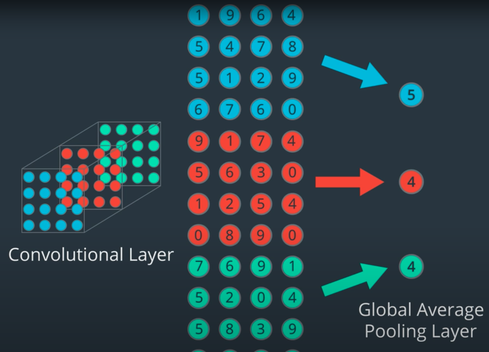

# Lsseon 8: CNN Layers

- ReLu's, and other activation functions, are typically placed after a 
convolutional layer to slightly transform the output so that it's more 
efficient to perform backpropagation and effectively train the network.

- Convolution layers are locally connected i.e. their nodes are connected only to
    a small subset of the previous layer nodes. 
- They have paramter sharing as well.
- Weights in Dense layers > Filters in Conv layers

- Higher dimensionality may occur in CNN due to large number of features, which
    can lead to overfitting.

- Pooling layers hence used to reduce the dimensionality. 2 types:
  1. Maxpooling layer
  2. Global Average Pooling Layer: 
     - window size, stride not required. It is more extreme.
     - Takes stack of feature maps and computes the average value of nodes for
         each map in the stack.
     - So, multidimensional feature array reduced to a vector. 

  

### A note on normalization

Normalization ensures that, as we go through a feedforward and then backpropagation step in training our CNN, that each image feature will fall within a similar range of values and not overly activate any particular layer in our network. During the feedfoward step, a network takes in an input image and multiplies each input pixel by some convolutional filter weights (and adds biases!), then it applies some activation and pooling functions. Without normalization, it's much more likely that the calculated gradients in the backpropagaton step will be quite large and cause our loss to increase instead of converge.

### Momentum
When you train a network, you specify an optimizer that aims to reduce the errors that your network makes during training. The errors that it makes should generally reduce over time but there may be some bumps along the way. Gradient descent optimization relies on finding a local minimum for an error, but it has trouble finding the global minimum which is the lowest an error can get. So, we add a momentum term to help us find and then move on from local minimums and find the global minimum!

- Always watch how much and how quickly your model loss decreases, and learn from improvements as well as mistakes!

## Feature Visualization

- techniques that allow us to see at each layer of the model, what kind of
    features the network has learned to extract.

### 1. Feature Maps (first layer)

- Each filter is convolved with the image and produces filtered outputs. These
    filtered output images are called feature maps or activation maps. Eg high
    pass filter

- First convolution layer often learns to create high pass filters. 

### 2. Layer activations (intermediate layers)

- Difficult to visualize intermediate layers since not connected directly to
    input image. Hence, filter weights doesn't give easy to read information.
- Looking at the feature maps of these layers as the network looks at specific
    images, which is called layer activations.
- It means looking at how a certain layer of feature maps activates when it sees
    a specific input image such as an image of a face.

### 3. Nearest neighbors in feature space (Second last layer)

- compute feature vectors from the second last layer in a number of images and
    then
- using metrics like L1 or MSE to compute nearest neighbor to compare which
    images are similar to each other. Eg orange and basketball

#### Dimensionality reduction

- reduce the dimensionality of the final feature vector so that we can display it in 2D or 3D space
that can then be plotted on an x-y axis or xyz axis

- PCA or t-SNE

## Other feature visualization techniques:

- Occlusion Experiments: 
  
  blocking out part of image and seeing how network responds.

- SAilencey Maps: 

  Which pixels are most important in classifying this image? 
  computing gradient of the class score with respect to the image pixels
  A saliency map tells us, for each pixel in an input image, if we change it's 
  value slightly (by dp), how the class output will change. If the class scores
  change a lot, then the pixel that experienced a change, dp, is important in the
  classification task.

- Guided Backpropagation:

  Similar to the process for constructing a saliency map, you can compute the gradients for mid level neurons in a network with respect to the input pixels. Guided backpropagation looks at each pixel in an input image, and asks: if we change it's pixel value slightly, how will the output of a particular neuron or layer in the network change. If the expected output change a lot, then the pixel that experienced a change, is important to that particular layer.

  This is very similar to the backpropagation steps for measuring the error between an input and output and propagating it back through a network. Guided backpropagation tells us exactly which parts of the image patches, that we’ve looked at, activate a specific neuron/layer.

## Applications : Deep Dream and Style Transfer

