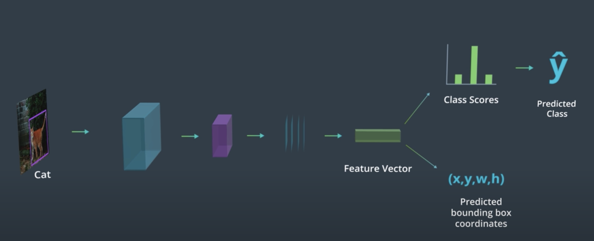

# Advanced CNN Architectures

- Real life have multiple objects in a scene. So, normal CNN cannot be used.
- Hence, advaned CNNs required which can classify mutliple objects in a scene.
- Classification and Localization of image 
  - done by using a bounding box around the image
- localization - key to creating a model that can classify multiple objects in
    an image.
- Region based CNNs - Fast R-CNN which analyzes different cropped areas of a
    single input image, decides which regions corresponds to objects and then
    perform classification as usual. 

    Applications - Medical diagnosis tools, autonomous vehicles

## Classification and Localization

Eg identifying a player holding basketball in an image requries localizing
basketball and person. 

- baby monitors
- safe driving applications - distraaacted driver detection

- similar to classification using CNN but with extra fully connected layer for
    predicting the bounding box.

  

### Loss functions

2 loss functions:

- Loss function for classification - Categorical Cross Entropy
- Loss function for regression (for predicting bounding box)
  - L1 Loss 
    - distance between the predicted and actual points
    - negligible for small error values
    - The unreduced (i.e. with reduction set to 'none') loss can be described as:
$$
\ell(x, y) = L = \{l_1,\dots,l_N\}^\top, \quad l_n = \left| x_n - y_n \right|,
$$
  - MSE Loss 
    - mean squared error between the predicted and actual points
    - responds most to large errors, so amplifies large and infrequent erros
        (outliers)

    - The unreduced (i.e. with reduction set to 'none') loss can be described as:
$$
\ell(x, y) = L = \{l_1,\dots,l_N\}^\top, \quad l_n = \left( x_n - y_n \right)^2,
$$
where $N$ is the batch size
$$\ell(x, y) = \begin{cases} \operatorname{mean}(L), & \text{if reduction} = \text{'mean';}\\ \operatorname{sum}(L), & \text{if reduction} = \text{'sum'.} \end{cases}
$$
x and y are tensors of arbitrary shapes with a total of n elements each.
  - SmoothL1 Loss
    - uses squared error function for small errors and
    - uses L1 loss for large errors
    - So, combines best aspects of L1 loss and MSE loss
        $$loss(x,y) =  \frac{1}{n}\sum_i z_i $$
where $z_{i}$ 
  is given by:

$$z_{i} = \begin{cases} 0.5 (x_i - y_i)^2, & \text{if } |x_i - y_i| < 1 \\ |x_i - y_i| - 0.5, & \text{otherwise } \end{cases}
$$


## Region Proposals

### How to detect multiple objects in an image?

One approach may be to simplify the input image and split it into two
different regions, each of which contains only one object.
Then, we can proceed in the same way as before, putting each region thorugh
a CNN that produces one class label and one bounding box.

### What if more objects than two.

Real Challenge is variable number of objects.
So, to detect variable amounts of objects in an image, you first must break the
image into smaller regions and produce bounding boxes and class labels for one
region and one object at a time.

### How to break image into regions?

- one approach - use bunch of cropped regions using sliding window? - extremely time intensive and
    many cropped regions dont contain objects.

### Solution:

The regions we want to analyze are those with complete objects in them. We want 
to get rid of regions that contain image background or only a portion of an 
object. So, two common approaches are suggested: 

1. identify similar regions using feature extraction or a clustering algorithm 
like k-means, as you've already seen; these methods should identify any areas 
of interest. 

2. Add another layer to our model that performs a binary classification on 
these regions and labels them: object or not-object; this gives us the 
ability to discard any non-object regions!


## R-CNN (Region-CNN)

Region Proposals used. 

The R-CNN is the least sophisticated region-based architecture, but it is the basis for understanding how multiple object recognition algorithms work! It outputs a class score and bounding box coordinates for every input RoI.

An R-CNN feeds an image into a CNN with regions of interest (RoI’s) already identified. 
ROIs are identified using Region proposal algorithm which basically use traditional CV techniques like edge detection, textured blobs detection to produce a set of regions in which objects are most
likely to be found. Eg. areas of similar texture or the same unifying boundary.

They often produce noisy non object regions but are also likely ot include
regions in which objects are located. So, noise - worthwile cost for not missing
objects

It then produces class for each ROI. Also include a class called background to capture
noisy regions.

Since these RoI’s are of varying sizes, they often need to be warped to be a standard size, since CNN’s typically expect a consistent, square image size as input. After RoI's are warped, the R-CNN architecture, processes these regions one by one and, for each image, produces 1. a class label and 2. a bounding box (that may act as a slight correction to the input region).

1. R-CNN produces bounding box coordinates to reduce localization errors; so a region comes in, but it may not perfectly surround a given object and the output coordinates (x,y,w,h) aim to perfectly localize an object in a given region.

2. R-CNN, unlike other models, does not explicitly produce a confidence score that indicates whether an object is in a region, instead it cleverly produces a set of class scores for which one class is "background". This ends up serving a similar purpose, for example, if the class score for a region is Pbackground = 0.10, it likely contains an object, but if it's Pbackground = 0.90, then the region probably doesn't contain an object.


## Fast R-CNN

- Instead of processing each ROI individually through a classification CNN, the
architecture runs the entire image through a classification CNN only once. 

- Project the region proposals into the deeper layer in the CNN i.e. the smaller feature map layer instead. Each
    region in the feature map corresponds to a larger region in the original
    image.

- Feed selected regions from feture map into fully connected layers one by one
    that generates class for each region.

- Handle vaiable size in the projections using RIO Pooling

### ROI Pooling

To warp regions of interest into a consistent size for further analysis, some networks use RoI pooling. RoI pooling is an additional layer in our network that takes in a rectangular region of any size, performs a maxpooling operation on that region in pieces such that the output is a fixed shape. Below is an example of a region with some pixel values being broken up into pieces which pooling will be applied to; a section with the values:

```
[[0.85, 0.34, 0.76],
 [0.32, 0.74, 0.21]]
```

Will become a single max value after pooling: 0.85.


### Speed

Fast R-CNN is about 10 times as fast to train as an R-CNN because it only creates convolutional layers once for a given image and then performs further analysis on the layer. Fast R-CNN also takes a shorter time to test on a new image! It’s test time is dominated by the time it takes to create region proposals.

## Faster R-CNN

- learns its own region proposals
- uses Region Proposal Network (RPN) with feature map as input
- binary classification for each ROI - object or non object
- rest steps similar 
