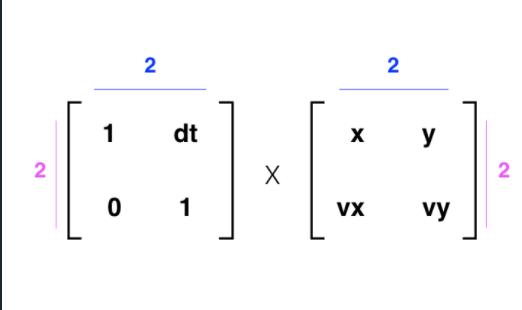
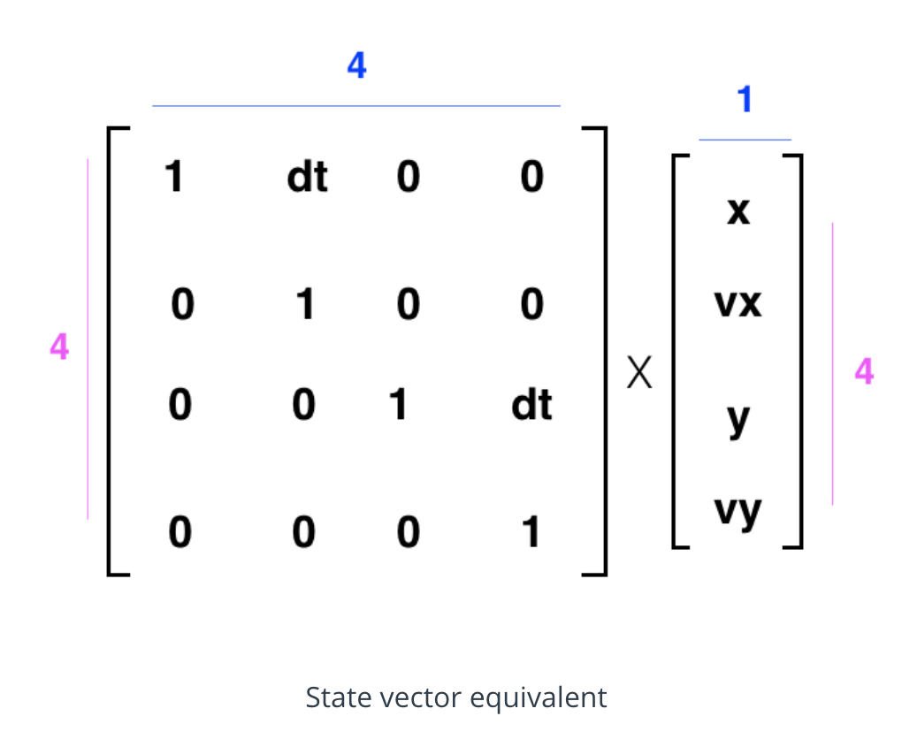

# State and Motion

Upto now localization done using Kalman filters

Now, representing state and motion

Prediction amde using: 

- Initial state Eg. [0, 50] (i.e. position, velocity)
- Assumption Eg. constant velocity - motion model: `distance = velocity *
    time`
  Using motion models to predict state of car at a future point of time

It’s important to note, that no motion model is perfect; it’s a challenge to account for outside factors like wind or elevation, or even things like tire slippage, and so on.

But these models are still very important for localization.

## Different model

- Constant acceleration
    ```
    displacement = initial_velocity*dt + 0.5*acceleration*dt**2
    dv = acceleration*dt
    ```

For our state, we always choose the smallest representation (the smallest number of variables) that will work for our model.

## 1. OOP
represent state in code. We’ll use variables to represent state values and we’ll create functions to change those values.

## 2 Linear Algebra 
use vectors and matrices to keep track of state and change it.

## State Vector

- easier for performing state updates since matrix multiplications can be used.
- always column vectors (not matrix even for multi dimension position or
    velocity) so that we can handle any x-y dependencies





2nd is used.

- These extra spaces in the matrix allow for more detailed motion models and can account for a x and y dependence on one another (just think of the case of circular motion).


