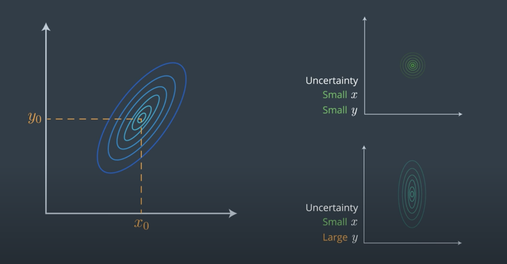
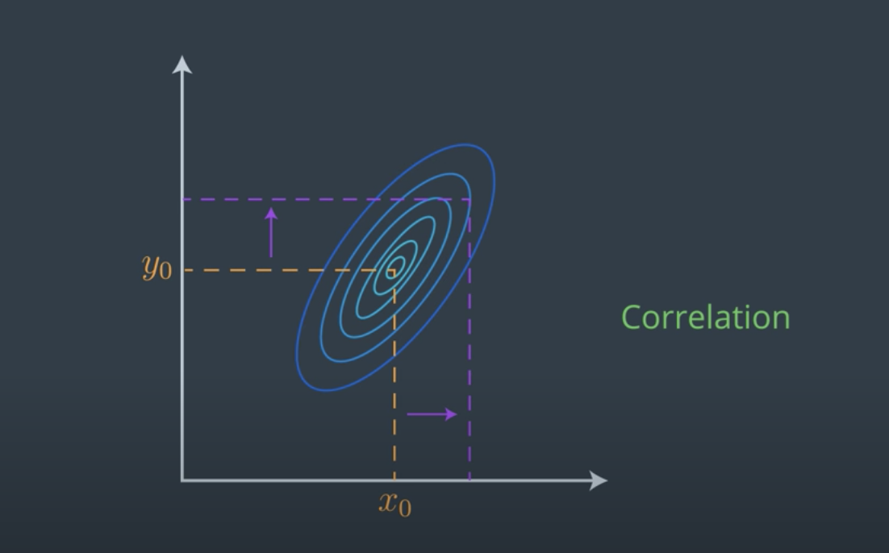
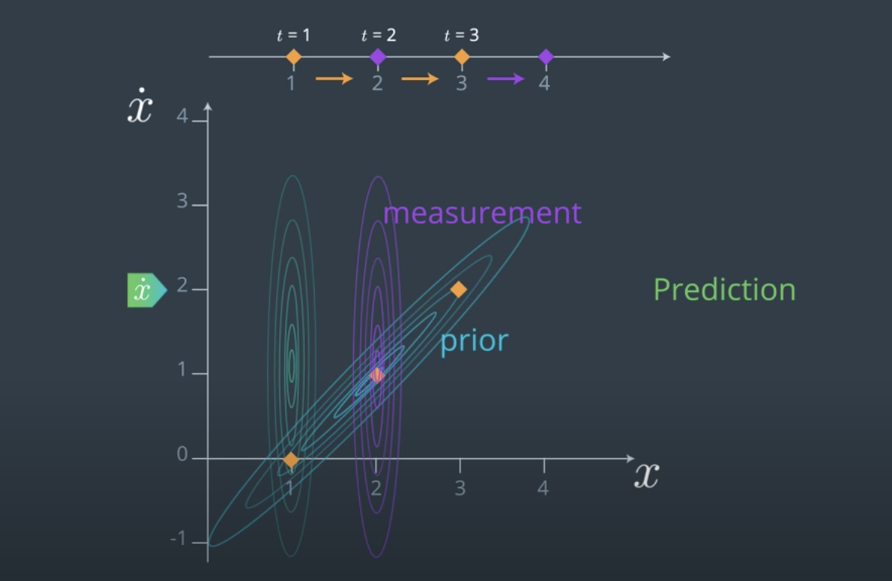
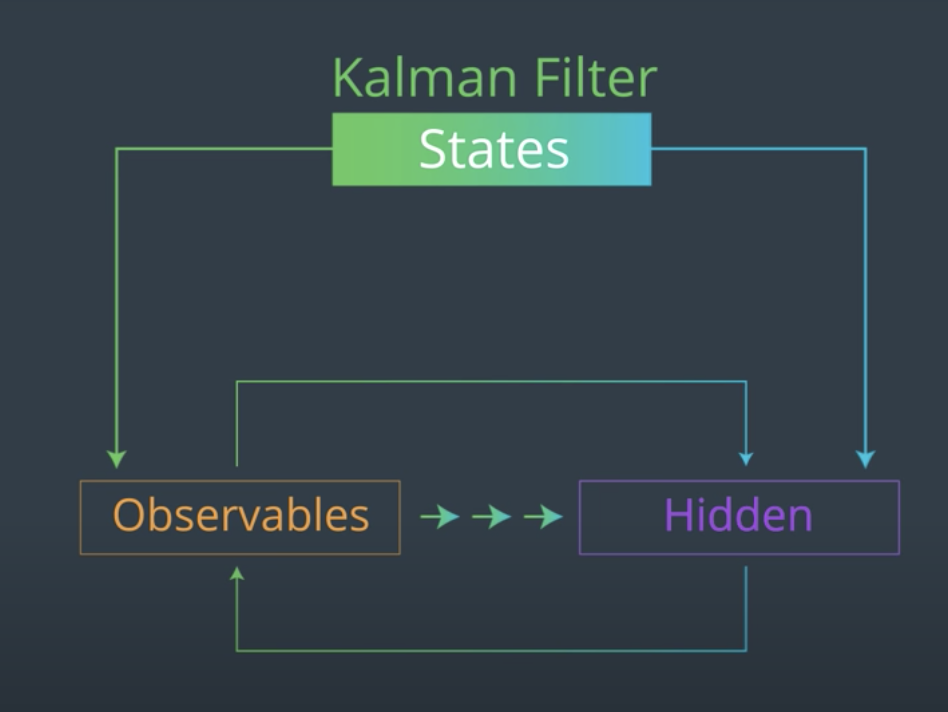
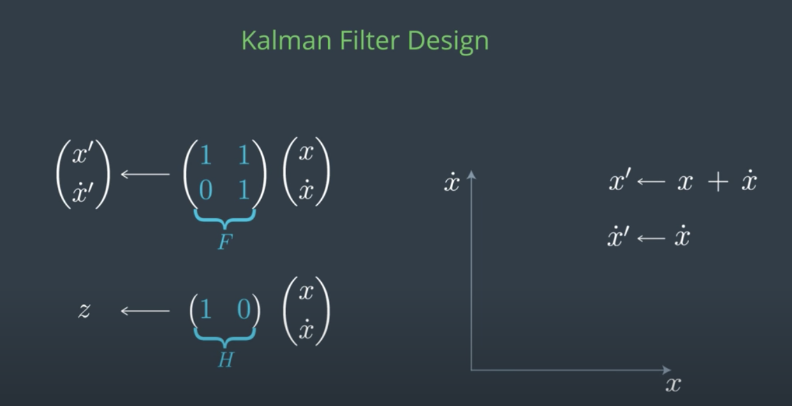
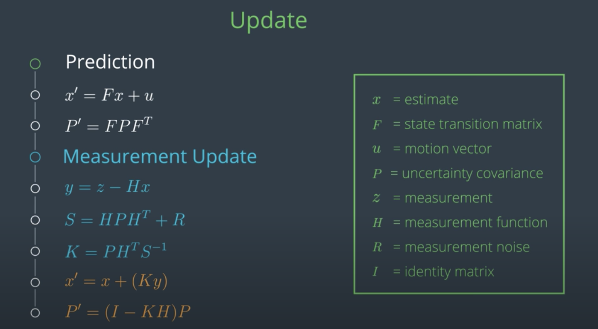
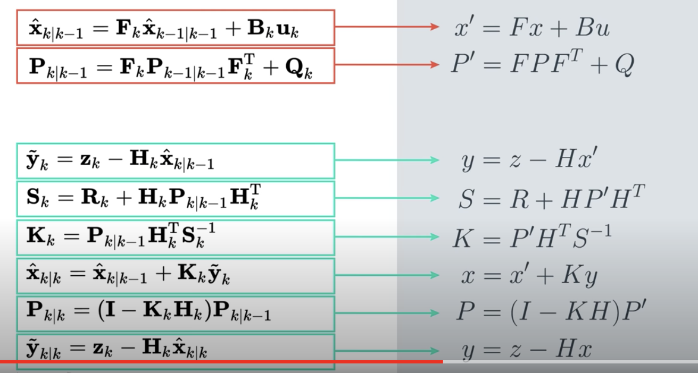

# Matrices and States Transformation

## Multivariate Gaussians

- Mean $\mu$ replaced by vector of means $\vec{\mu} = \begin{bmatrix}\mu_0\\\mu_1\\.\\.\\.\\\mu_D\end{bmatrix}$

- Variance $\sigma^2$ replaced by Co-variance matrix $\Sigma_{DxD}$
 

**Example of 2d Gaussian**

## 2D Kalman Filters

- x-axis -> position
- y-axis -> velocity
- modeled by 2d gaussian

Example:

- By only observing one variable (position), we have been able to infer
    unibserved variable (velocity) due to the relations between them. i.e.

    $x' = x + \Delta t \dot{x}$

    $\dot{x}$ - velocity in x direction

    $x'$ x position after motion

    $x$ x position before motion
    
    the x position after motion is equal to the x position before motion plus the velocity in the x direction.

## Kalman Filter Design
We need:

- State transformation matrix for state
- Measurement function for measurement

## Simplifications of Kalman's Equations from wikipedia

